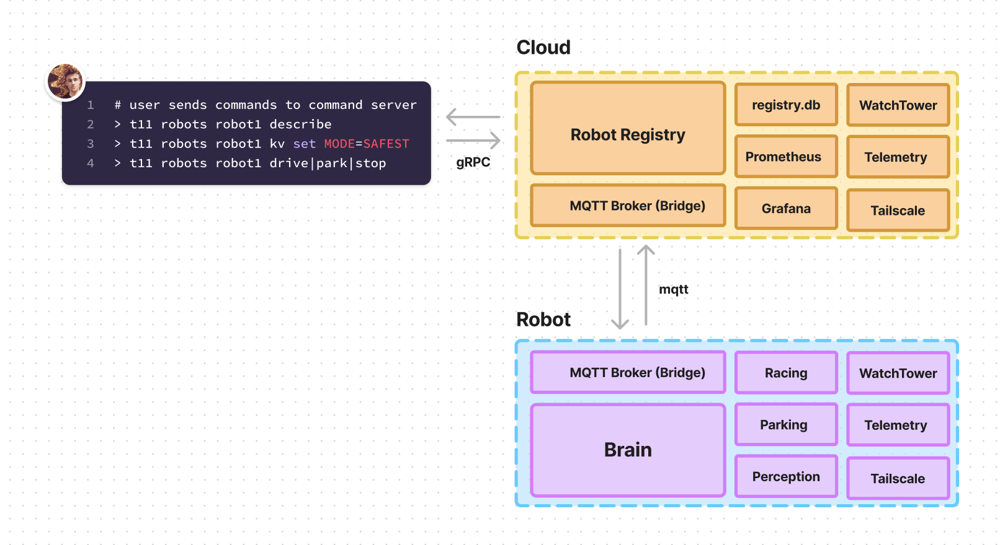

# Team 11 Autonomous Robots - project monorepo

This repository contains all source code for the Autonomous Robots group project of Team

Team members:

- Erik Håkansson
- Kris Huang
- Johannes Graule

()



### Structure & Organisation

```bash
├── .gitlab-ci.yml              # base CI/CD file that delegates to childs
├── LICENSE
├── README.md                   # What you are reading
├── ansible                     # contains infra-as-code (IAC)
│   ├── .ansible-ci.yml
│   ├── .gitkeep
│   └── test.txt
├── docs                        # any reosurces that extends README.md
├── robot-service-template      # template for cpp DLV services
└── web-service-template        # template for go web services
```

## Getting started

### Repository setup

1. Clone the Repository

```bash
# via ssh (requires you having added your public ssh key to your gitlab profile)
git clone git@git.chalmers.se:erhaka/team11-project-monorepo.git

# via https
git clone git@git.chalmers.se:erhaka/team11-project-monorepo
```

2. Change your directory to the service you wish to run and follow its getting started instructions, usually its enough to run "docker run" or "docker compos up".

### Services

THe entire repository is structured in services or smaller self-contained applications. We apply a faily flat layout, where the root project .gitlab-ci file is in charge of delegating CI/CD jobs to to each service.

If you are new to using pull requests and git, [trunk-based-git](https://www.atlassian.com/continuous-delivery/continuous-integration/trunk-based-development) is a great guide for the style of git and project deployment we'll use. Every need service or alteration of an existing service starts with you making a feature branch for the given service. See below for an example:

```bash
# create a new feature branch. Note its imporant to prepend feature/<mydescription> for the CI/CD to do its job.
git checkout -B feature/cloud-configuration-server-setup

# create a new microservice from the boilerplates
cp -r boilerplate/cloud-service-g cloud/configuration-server-setup
cd cloud-configuration-server-setup

# below portion can be repeated multiple times as your contribution includes more changes or files
echo "hello, world in a textfile" > hello.txt

# add the file (so gut can track changes for it)
git add hello.txt

# running git status should reveal the file being tracked
git status

# commit the changes to the added file (i.e. the text entry)
git commit hello.txt -m "addded a nice text"

# -m is for a message describing what you've done! It is advised to try to be clear
# what was done, e.g. "more-stuff" is worse than "added-namespace-creation". (Don't sweat it too much though!)[https://xkcd.com/1296/]

# let's now try to change the file to see how git works
echo "HELLO, WORLD IN A TEXTFILE BUT CAPS" > hello.txt

# see the change being not committed
git status

# commit the change
git commit hello.txt -m "textfile with more oompf"

# backing up your change (and make it ready for merging)
git push -u origin feature/cloud-configuration-server-setup
```

Once you've pushed your last change and you feel done you can create a new pull request to bring your changes into the main branch. Follow the [guide](https://www.google.com/search?client=firefox-b-d&q=gitlab+pull+request) and once your merge request is reviewd and approved, you changes will automatically released.

### Extending an existing service

When extending existing services, using the above will suffice to get your code into the project all the way up to release (which requires a manual step covered in next section).

### Deplyoment & Release

Deployment and release differs signicantly depending on the intended target platform. These differences are specific to each service and you can always inspect the service-ci.yml to see what the release implies.Generally, release and deployment means bulding a container image and pushing to Gitlab's (container registry)[https://git.chalmers.se/erhaka/team11-project-monorepo/container_registry/1380]. This is done automaticlly by the build system and it can be triggered by making a semanttic version tag like:

```bash
cd robot-service-template
git tag -a robot-service-template-v2.0.0

# trigger release by pushing the tag
git push -u robot-service-template-v2.0.0
```

Note that you do need to prepend the service name (see service-ci.yml for what that is for your given service). You shoudl also reespect the (semantic versioning)[https://semver.org/]

### Creating a new service

insert
